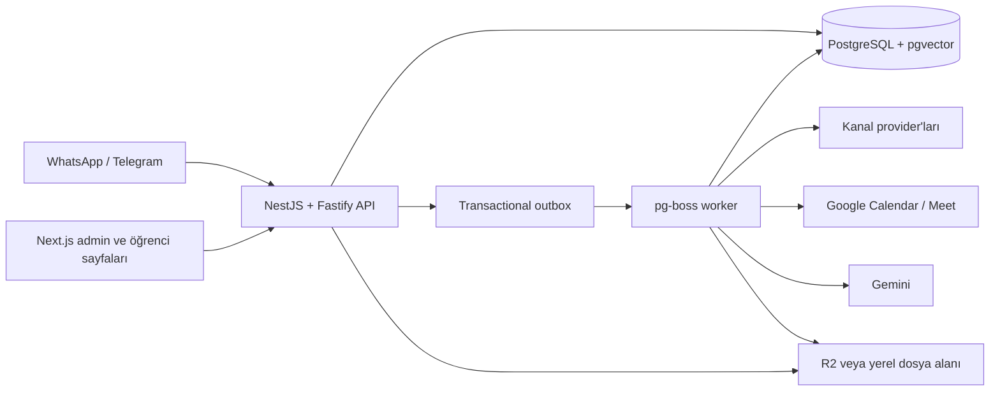

# Meditasyon Öğrenci Portalı

Meditasyon öğrencilerinin WhatsApp ve Telegram üzerinden kaydolmasını, ödeme ve
üyelik süreçlerinin yönetilmesini, günlük pratiklerin takip edilmesini ve haftalık
görüşmelerin planlanmasını tek yerde toplayan öğrenci operasyon platformu.

Proje; yönetim paneli ve öğrenciye açılan içerik deneyimleri, NestJS API'si ve
PostgreSQL tabanlı arka plan işleyicisinden oluşan bir TypeScript monorepo'sudur.

## Özellikler

- **Kayıt ve üyelik:** Kanal bazlı kayıt akışı, KVKK/AI rızaları, ödeme bildirimi,
  admin onayı, abonelik dönemi ve görüşme kredileri.
- **Öğrenci yönetimi:** Profil, kanal kimlikleri, notlar, izinler, ödeme geçmişi,
  pratik devamlılığı ve öğrenci durum geçmişi.
- **Pratik programı:** Sürümlenmiş günlük planlar, zamanlanmış seanslar,
  hatırlatmalar, hızlı yanıtlar, değerlendirmeler ve duraklatma/iptal akışları.
- **Meditasyon kütüphanesi:** Meditasyon türleri, kaynak sesler, farklı sürelerde
  ses üretimi, öğrenciye özel erişim ve paylaşılabilir herkese açık oynatıcılar.
- **Görüşmeler:** Haftalık seri planlama, Google Calendar/Meet senkronizasyonu,
  hatırlatmalar, koç notları ve onaylanan haftalık özetler.
- **Mesajlaşma ve operasyon:** WhatsApp/Telegram webhook'ları, konuşma gelen
  kutusu, admin yanıtları, insan desteğine aktarım, teslimat takibi ve bildirimler.
- **İçerik araçları:** Bölümlü okumalar, PDF/Markdown içe aktarma, öğrenci
  atamaları, herkese açık bağlantılar, okuma ilerlemesi ve salt okunur Excalidraw
  paylaşımları.
- **LLM ve bilgi bankası:** Sürümlenmiş prompt'lar, provider/model seçimi, bütçe
  ve kullanım kayıtları, pgvector tabanlı RAG, bağlam denetimi ve feature flag'ler.
- **Güvenlik:** Parola + TOTP admin girişi, recovery code, CSRF koruması, hassas
  alan şifreleme, arama HMAC'leri, audit log ve transactional outbox.

## Mimari



Çalışan üç ana süreç vardır:

| Süreç         | Sorumluluk                                                              | Yerel adres             |
| ------------- | ----------------------------------------------------------------------- | ----------------------- |
| `apps/admin`  | Admin portalı, okuma/çizim sayfaları ve meditasyon oynatıcıları         | `http://localhost:3001` |
| `apps/api`    | REST API, auth, webhook kabulü ve domain servisleri                     | `http://localhost:3000` |
| `apps/worker` | Outbox aktarımı, mesaj gönderimi, zamanlanmış işler, RAG ve ses üretimi | Arka plan süreci        |

Worker kuyruğu pg-boss ile PostgreSQL üzerinde çalışır. Böylece domain değişikliği
ile kuyruğa aktarılacak olay aynı transaction sınırı içinde tutulur.

## Teknoloji yığını

- Node.js 22, pnpm 10 ve TypeScript 5
- Next.js 15, React 19 ve ortak UI/design-token paketleri
- NestJS 11, Fastify ve Zod
- PostgreSQL 16, pgvector, Prisma 6 ve pg-boss
- Gemini adapter'ları, Cloudflare R2 uyumlu nesne depolama ve ClamAV
- Vitest, Playwright, ESLint ve Prettier
- Docker multi-stage build, GitHub Actions ve Coolify

## Monorepo yapısı

| Yol                                                | İçerik                                                             |
| -------------------------------------------------- | ------------------------------------------------------------------ |
| [`apps/admin`](apps/admin)                         | Admin portalı ve öğrenciye açık web deneyimleri                    |
| [`apps/api`](apps/api)                             | NestJS/Fastify API ve domain modülleri                             |
| [`apps/worker`](apps/worker)                       | Kuyruk tüketicileri ve zamanlanmış işler                           |
| [`packages/core`](packages/core)                   | Domain kuralları, provider sözleşmeleri ve güvenlik primitive'leri |
| [`packages/database`](packages/database)           | Prisma şeması, migration'lar ve repository altyapısı               |
| [`packages/ui`](packages/ui)                       | Paylaşılan React bileşenleri ve stiller                            |
| [`packages/design-tokens`](packages/design-tokens) | Renk, tipografi ve ölçü token'ları                                 |
| [`packages/prompts`](packages/prompts)             | Git ile sürümlenen LLM prompt'ları                                 |
| [`packages/testing`](packages/testing)             | Fake clock ve kanal test yardımcıları                              |
| [`scripts`](scripts)                               | Yerel kurulum, seed, içerik import ve E2E komutları                |

## Yerel kurulum

### Gereksinimler

- Node.js `>=22.12.0`
- pnpm `>=10` (kilitlenen sürüm: `10.30.3`)
- Docker ve Docker Compose
- Meditasyon sesi üretilecekse yerel worker için `ffmpeg`/`ffprobe`

### 1. Bağımlılıkları ve altyapıyı hazırlayın

```bash
pnpm install
pnpm setup:local
docker compose up -d --wait postgres
pnpm db:generate
pnpm db:migrate
pnpm build
pnpm --filter @meditation/api sync-prompts
```

`pnpm setup:local`, yalnızca `.env` bulunmadığında [`.env.example`](.env.example)
dosyasını kopyalar ve geliştirme ortamına özel şifreleme/HMAC anahtarları üretir.
Var olan `.env` dosyasını değiştirmez. Tek başına yeni anahtar üretmek için
`pnpm secrets:generate` kullanılabilir.

Bilgi bankasına yüklenen dosyaların yerelde taranması gerekiyorsa ClamAV'ı da
başlatın:

```bash
docker compose up -d --wait clamav
```

### 2. İlk admin hesabını oluşturun

Migration'lardan sonra aşağıdaki tek kullanımlık komutu çalıştırın:

```bash
ADMIN_BOOTSTRAP_ENABLED=true \
ADMIN_BOOTSTRAP_EMAIL=admin@example.com \
ADMIN_BOOTSTRAP_PASSWORD='en-az-12-karakterli-guclu-parola' \
pnpm --filter @meditation/api bootstrap-admin
```

Komut TOTP secret'ını ve recovery code'ları yalnızca bir kez stdout'a yazar.
Bunları güvenli bir yere kaydedin ve TOTP secret'ını authenticator uygulamanıza
ekleyin. Veritabanı ikinci bootstrap denemesini reddeder.

İsterseniz geliştirme veritabanına örnek öğrenciler, konuşmalar, pratikler ve
görüşmeler ekleyebilirsiniz:

```bash
pnpm seed:demo
```

### 3. Uygulamayı çalıştırın

Üç ayrı terminalde:

```bash
pnpm dev:api
```

```bash
pnpm dev:worker
```

```bash
pnpm dev:admin
```

Ardından `http://localhost:3001/login` adresinden bootstrap sırasında belirlenen
e-posta, parola ve TOTP koduyla giriş yapın.

| Adres                                | Açıklama                                      |
| ------------------------------------ | --------------------------------------------- |
| `http://localhost:3001`              | Admin portalı                                 |
| `http://localhost:3000/health/live`  | API process canlılık kontrolü                 |
| `http://localhost:3000/health/ready` | Yapılandırma + veritabanı hazır olma kontrolü |
| `/m#<erişim-kodu>`                   | Öğrenciye atanmış pratik oynatıcı             |
| `/meditasyon/<slug>`                 | Herkese açık meditasyon sayfası               |
| `/read#<token>`                      | Öğrenciye atanmış okuma                       |
| `/oku/<slug>`                        | Herkese açık okuma                            |
| `/drawing#<token>`                   | Öğrenciye atanmış salt okunur çizim           |

## Yapılandırma ve entegrasyonlar

Temel geliştirme ortamı için gerekli kriptografik değerler `setup:local`
tarafından hazırlanır. Harici özellikler aşağıdaki değişkenler sağlandığında
etkinleştirilebilir:

| Alan                 | Başlıca değişkenler                                                                                 |
| -------------------- | --------------------------------------------------------------------------------------------------- |
| Admin/API            | `ADMIN_ORIGIN`, `NEXT_PUBLIC_API_URL`, `ADMIN_SESSION_HMAC_KEY`                                     |
| Veri güvenliği       | `DATA_ENCRYPTION_KEYS_JSON`, `ACTIVE_DATA_KEY_ID`, `LOOKUP_HMAC_KEY`                                |
| WhatsApp             | `WHATSAPP_VERIFY_TOKEN`, `WHATSAPP_APP_SECRET`, `WHATSAPP_ACCESS_TOKEN`, `WHATSAPP_PHONE_NUMBER_ID` |
| Telegram             | `TELEGRAM_BOT_TOKEN`, `TELEGRAM_WEBHOOK_SECRET`, `TELEGRAM_ACCOUNT_ID`                              |
| Ödeme ve iç komutlar | `PAYMENT_IBAN`, `PAYMENT_ACCOUNT_HOLDER`, `INTERNAL_COMMAND_SECRET`                                 |
| Google Calendar      | `GOOGLE_OAUTH_CLIENT_ID`, `GOOGLE_OAUTH_CLIENT_SECRET`, `GOOGLE_OAUTH_REDIRECT_URI`                 |
| LLM                  | `GEMINI_API_KEY`                                                                                    |
| Nesne depolama       | `R2_ENDPOINT`, `R2_ACCESS_KEY_ID`, `R2_SECRET_ACCESS_KEY`, bucket adları                            |
| Dosya tarama         | `CLAMAV_HOST`, `CLAMAV_PORT`                                                                        |
| Gönderim güvenliği   | `ALLOWED_RECIPIENTS`                                                                                |

Google OAuth redirect URI'si yerelde
`http://localhost:3000/v1/admin/google-calendar/oauth/callback` olmalıdır.

R2 bilgileri verilmezse belge ve medya depolama geliştirme ortamında yerel dosya
sistemine düşer. Bilgi bankası ingest/embedding, agent reply ve AI haftalık özet
özellikleri; ilgili Gemini model/task ayarı ve feature flag açılana kadar kapalı
kalır. Prompt dosyaları değiştiğinde tekrar şu komutu çalıştırın:

```bash
pnpm build
pnpm --filter @meditation/api sync-prompts
```

`staging` ve `production` ortamlarında eksik zorunlu secret'lar uygulamanın
başlamasını engeller. Güncel sözleşmenin kaynakları [`.env.example`](.env.example)
ve [`packages/core/src/config.ts`](packages/core/src/config.ts) dosyalarıdır;
secret değerlerini repoya commit etmeyin.

## Yararlı komutlar

| Komut                                                        | Açıklama                                                        |
| ------------------------------------------------------------ | --------------------------------------------------------------- |
| `pnpm check`                                                 | Format, lint, typecheck ve unit test zinciri                    |
| `pnpm build`                                                 | Tüm uygulama ve paketleri derler                                |
| `pnpm test:db`                                               | Yerel PostgreSQL üzerinde database integration testleri         |
| `pnpm e2e:registration`                                      | İzole geçici DB ile Telegram kayıt/ödeme E2E akışı              |
| `pnpm e2e:knowledge`                                         | İzole geçici DB ile bilgi bankası E2E akışı                     |
| `pnpm e2e:admin`                                             | Desktop ve mobil Playwright UI testleri                         |
| `pnpm seed:demo`                                             | Geliştirme veritabanına tekrar çalıştırılabilir demo veri ekler |
| `pnpm import:reading -- --markdown=./icerik.md --sections=5` | Markdown okumayı bölümlere ayırarak içe aktarır                 |

Registration ve knowledge E2E komutları PostgreSQL'i başlatır, her çalıştırma için
geçici bir veritabanı oluşturur, migration'ları uygular ve test sonunda veritabanını
siler. Admin E2E testleri Next.js sunucusunu otomatik başlatır ve API çağrılarını
test içinde izole eder.

## Dağıtım

[`Dockerfile`](Dockerfile) üç ayrı target üretir: `api`, `admin` ve `worker`.
Production API container'ı açılışta `prisma migrate deploy` ve prompt
senkronizasyonunu çalıştırır; worker imajı meditasyon sesleri için ffmpeg içerir.
Admin imajı oluşturulurken public API adresi `NEXT_PUBLIC_API_URL` build argümanı
olarak verilmelidir.

`v*` etiketi [release workflow'unu](.github/workflows/release.yml) başlatır. Akış
kalite ve build kontrollerinden sonra önce `staging`, onay sonrasında `production`
Coolify webhook'unu çağırır. Her GitHub Environment aşağıdaki secret'lara sahip
olmalıdır:

- `COOLIFY_WEBHOOK`: İlgili uygulamanın HTTPS deploy webhook'u
- `COOLIFY_TOKEN`: Yalnızca deploy yetkili API token'ı

Production environment için required reviewer tanımlanmalıdır. Secret eksik,
webhook HTTPS değil veya Coolify çağrısı başarısızsa workflow fail-closed durur.

## Belgeler

- [Proje taslağı](docs/PROJECT_DRAFT.md)
- [Teknik uygulama planı](docs/TECHNICAL_PLAN.md)
- [Açık kararlar](docs/OPEN_DECISIONS.md)
- [UI tasarım sistemi](docs/UI_DESIGN_SYSTEM.md)
- [Meditasyon bilgi içeriği](docs/Knowledge.md)
